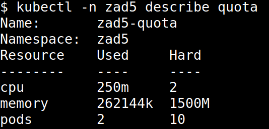
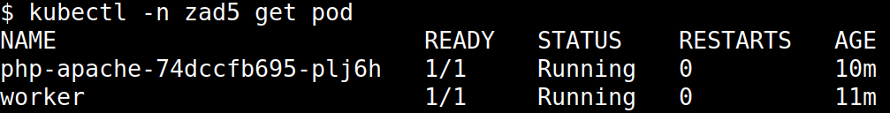
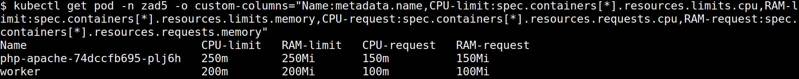
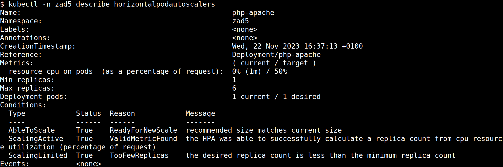
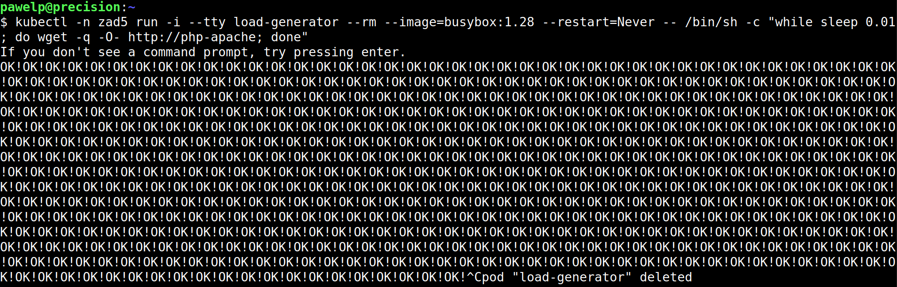
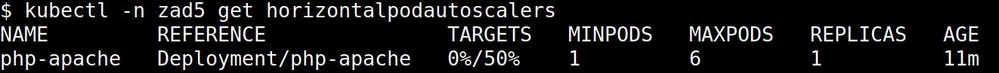
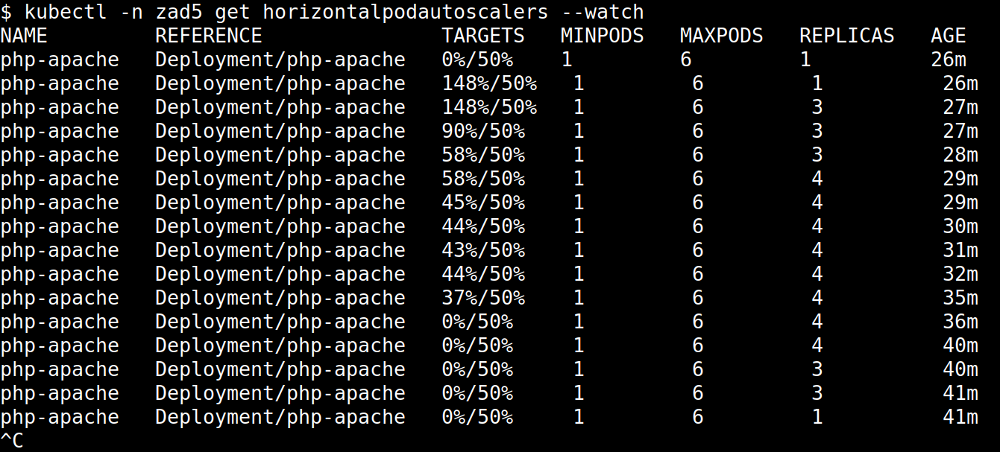

# Kubernetes - zadanie do laboratorium 5

## Zadanie 1.
Definicja zestawu ograniczeń zasobów (_quota_) znajduje się w pliku [quota.yml](./quota.yml).

## Zadanie 2.
Definicja poda _worker_ znajduje się w pliku [pod.yml](./pod.yml).

## Zadanie 3.
Zmodyfikowane definicje obiektów _Deployment_ i _Service_ znajdują się w pliku [php-apache.yml](./php-apache.yml).

## Zadanie 4.
Definicja obiektu _HorizontalPodAutoscaler_ znajduje się w pliku [horizontal-pod-autoscaler.yml](./horizontal-pod-autoscaler.yml).

Wartość parametru `maxReplicas` została ustawiona na 6, aby w żadnym wypadku nie przekroczyć limitu pamięci RAM zdefiniowanego dla przestrzeni nazw. Limit ten wynosi 1500 MiB, w związku z czym jeśli każda replika wykorzysta całą dostępną dla siebie pamięć (250 MiB), to sumaryczne użycie wyniesie dokładnie 1500 MiB. Jednocześnie 6 działających replik na pewno nie przekroczy limitu wykorzystania CPU przypisanego do przestrzeni nazw, ponieważ wynosi on 2000m, a 6 replik użyje sumarycznie nie więcej niż 1500m.

Zamiast `targetCPUUtilizationPercentage` użyto parametru `averageUtilization` w sekcji `metrics` (zgodnie z dokumentacją [HorizontalPodAutoscaler Walkthrough](https://kubernetes.io/docs/tasks/run-application/horizontal-pod-autoscale-walkthrough/)), ponieważ użycie `targetCPUUtilizationPercentage` powodowało wyświetlenie komunikatu o nieznanym parametrze (prawdopodobnie został on usunięty w zastosowanej wersji Kubernetes).

## Zadanie 5.
Do utworzenia zdefiniowanych obiektów wykorzystano następujące polecenia:
```
kubectl apply -n zad5 -f quota.yml
kubectl apply -n zad5 -f pod.yml
kubectl apply -n zad5 -f php-apache.yml
kubectl apply -n zad5 -f horizontal-pod-autoscaler.yml
```

Weryfikacja poprawności utworzenia obiektu _quota_:
```
kubectl -n zad5 describe quota
```



Weryfikacja poprawności utworzenia podów (_worker_ oraz poda zdefiniowanego w `php-apache.yml`):
```
kubectl -n zad5 get pod
```



Weryfikacja limitów zasobów:
```
kubectl get pod -n zad5 -o custom-columns="Name:metadata.name,CPU-limit:spec.containers[*].resources.limits.cpu,RAM-limit:spec.containers[*].resources.limits.memory,CPU-request:spec.containers[*].resources.requests.cpu,RAM-request:spec.containers[*].resources.requests.memory"
```



Weryfikacja poprawności utworzenia autoskalera:
```
kubectl -n zad5 describe horizontalpodautoscalers
```



## Zadanie 6.
Przed utworzeniem poda generującego obciążenie, utworzono obiekt _LimitRange_ z domyślnymi limitami zasobów, aby nie było konieczności definiowania ich przy uruchamianiu poda. Definicja obiektu znajduje się w pliku [limit-range.yml](./limit-range.yml).

Aby wygenerować obciążenie procesora i przetestować autoskaler, wykorzystano polecenie:
```
kubectl -n zad5 run -i --tty load-generator --rm --image=busybox:1.28 --restart=Never -- /bin/sh -c "while sleep 0.01; do wget -q -O- http://php-apache; done"
```



Przed uruchomieniem generatora obciążenia działała tylko 1 replika _php-apache_:



W trakcie działania generatora obciążenia, autoskaler stopniowo zwiększał liczbę działających replik, aby wykorzystanie procesora nie przekraczało 50%, zgodnie z założeniami. Optymalną liczbą replik okazało się być 4 - obciążenie procesora dla każdej repliki wynosiło wtedy około 45%. Po zatrzymaniu generatora obciążenia, liczba replik została z powrotem zredukowana do 1. Poniższy zrzut ekranu przedstawia wyniki procesu skalowania liczby replik po uruchomieniu generatora oraz po jego zatrzymaniu:


